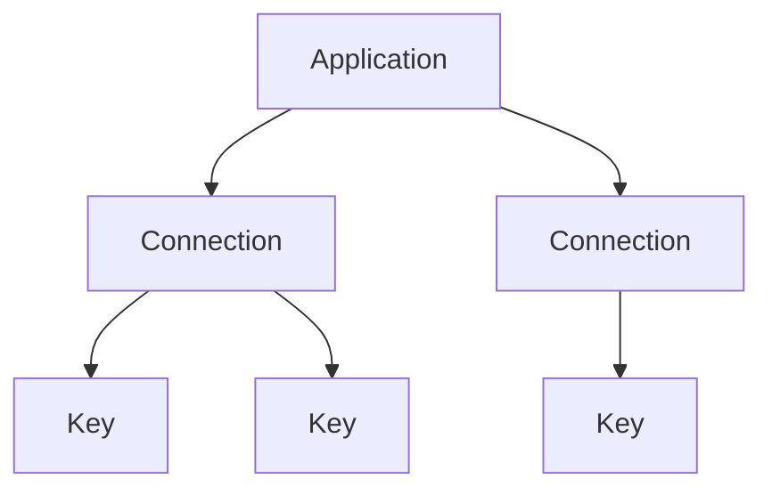

Hicap organizes everything you build around a simple three-level hierarchy: an **Application** has one or more **Connections**, and each Connection issues one or more **Keys**. Because keys hang off Connections and Connections hang off Applications, usage and spend roll up the hierarchy automatically — with nothing extra to send at call time.

## The hierarchy

### Application

An **Application** is the thing you are building or buying that consumes AI — a product, service, or workload. It's the unit you organize and report spend around. Group your work into Applications the way you think about it internally, so that reporting matches how you plan and budget.

### Connection

A **Connection** binds an Application to a model provider — OpenAI, Anthropic, Google, ElevenLabs, and others. It carries the provider choice and its configuration. An Application can have more than one Connection, so a single product can draw on several providers at once.

### Key

A **Key** is the credential a client actually sends. It's issued under a Connection, so every request made with that key inherits the Application and Connection it belongs to. You can issue multiple keys per Connection — rotate one without downtime, or issue one key per environment or deployment.

## Why the hierarchy pays off

Because the relationships are fixed by how you provisioned things, attribution requires nothing at call time:

- **Usage and spend roll up automatically.** Every request carries its Key, and the Key already knows its Connection and Application. Reporting aggregates up the hierarchy with no extra work on each call.
- **Changes stay contained.** Revoking a key does not disturb the Connection, and removing a Connection does not disturb the Application. You can rotate credentials or swap providers without reorganizing anything above them.

## When to add another one

<AccordionGroup>
  <Accordion title="When to add another Application">
    Add a new Application when you're building a distinct product or workload that you want to plan, budget, and report on separately.
  </Accordion>
  <Accordion title="When to add another Connection">
    Add a Connection when an Application needs a different provider, or a different provider configuration — for example, using one provider for chat and another for voice.
  </Accordion>
  <Accordion title="When to add another Key">
    Add a Key when you want to rotate credentials without downtime, or when you want a separate credential per environment (development, staging, production) or per deployment.
  </Accordion>
</AccordionGroup>

## Structural vs. descriptive attribution

Applications, Connections, and Keys give you **structural** attribution: it comes from which key you used, requires nothing at call time, and is fixed by how you provisioned things. For **descriptive** attribution — labels you choose per request and can redefine after the fact — see [Tags, Dimensions & Segments](/concepts/tags-dimensions-segments). Both roll up into the same spend reporting; they answer different questions.
