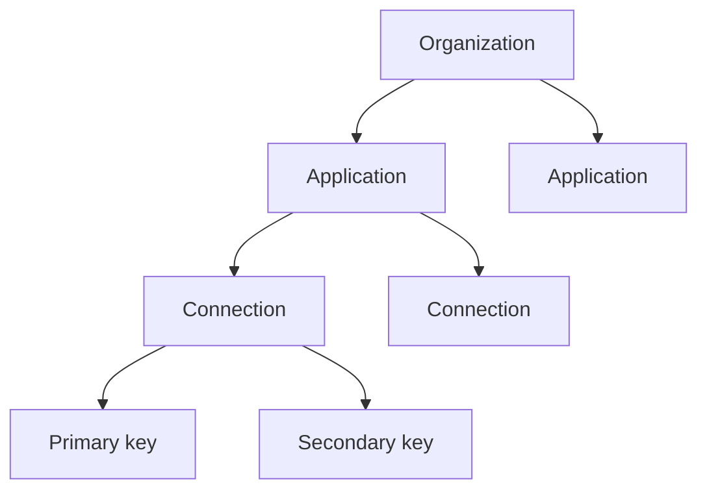

The Hicap AI Gateway organizes everything you build around a clear hierarchy: an **Organization** contains **Applications**, an Application has one or more **Connections**, and each Connection carries a pair of **Keys**. A Connection is a governance scope — it's where budgets, allowed models, and default routing live. Because Keys belong to a Connection and Connections belong to an Application, usage and spend roll up automatically — with nothing extra to send at call time.

## The hierarchy

### Organization

An **Organization** is your company's account on the Hicap AI Gateway. It contains your **users** and the Applications they work on, and it is the top level that all usage and spend ultimately roll up to.

Organizations are also where **teams** live. A team is a group of users inside your Organization — it describes who people are and what they can reach, not how a request is labeled.

### Application

An **Application** is a product, service, or workload that consumes AI. Applications are the rollup point for Keys: every Key ultimately reports its usage into the Application it belongs to, which makes the Application the natural unit to plan, budget, and report on.

Group your work into Applications the way you think about it internally, so reporting matches how you already plan.

### Connection

A **Connection** is a governance scope within an Application, and it is what Keys are issued against. It's where you set the rules that requests made with its Keys must follow:

- **Budgets** — spend limits for everything that runs under the Connection.
- **Allowed models** — which models Keys on this Connection may call.
- **Default routing** — the default model behavior applied when a request doesn't specify one.
- **Reporting boundaries** — a scope you can slice usage and spend by on its own.

An Application can have more than one Connection, so you can apply different budgets, model allowances, and routing to different parts of the same product — for example a tightly capped Connection for experiments alongside a production one.

### Keys

A **Key** is the credential your client actually sends. Every Connection carries two Keys — a **primary** and a **secondary** — and either one is equally valid for making requests.

Two Keys exist so you can rotate without downtime. Your clients move from one Key to the other, and once nothing is using the old Key it can be regenerated safely. At no point do you need a maintenance window, and at no point does the Connection or the Application above it change.

Because a Key is issued under a Connection, every request made with it already carries the Connection and the Application it belongs to.

## Why the hierarchy pays off

Because the relationships are fixed when you provision them, attribution requires nothing at call time:

- **Usage and spend roll up automatically.** Every request carries its Key, and the Key already knows its Connection, its Application, and your Organization. Reporting aggregates up the hierarchy with no extra work on each call.
- **Changes stay contained.** Regenerating a Key does not disturb the Connection, and removing a Connection does not disturb the Application. You can rotate credentials or adjust a Connection's budget, allowed models, or routing without reorganizing anything above.

## When to add another one

<AccordionGroup>
  <Accordion title="When to add another Application">
    Add an Application when you're building a distinct product or workload you want to plan, budget, and report on separately. Because Applications are where Keys roll up, this is the boundary that shapes your reporting.
  </Accordion>
  <Accordion title="When to add another Connection">
    Add a Connection when part of an Application needs its own governance — a different budget, a different set of allowed models, or different default routing. For example, a capped Connection for experimentation alongside a production one. Each Connection brings its own pair of Keys.
  </Accordion>
  <Accordion title="When to use the secondary Key">
    Use the secondary Key to rotate credentials without downtime: move clients onto it, confirm nothing is still calling with the primary, then regenerate the primary. If you want separate credentials per environment, add a Connection per environment rather than splitting the two Keys across them.
  </Accordion>
</AccordionGroup>

## Structural vs. descriptive attribution

Organizations, Applications, Connections, and Keys give you **structural** attribution: it comes from which Key you used, requires nothing at call time, and is fixed by how you provisioned things.

For **descriptive** attribution — labels you choose per request and can reinterpret afterwards — see [Tags, Dimensions & Segments](/concepts/tags-dimensions-segments). Both roll up into the same spend reporting; they answer different questions.
