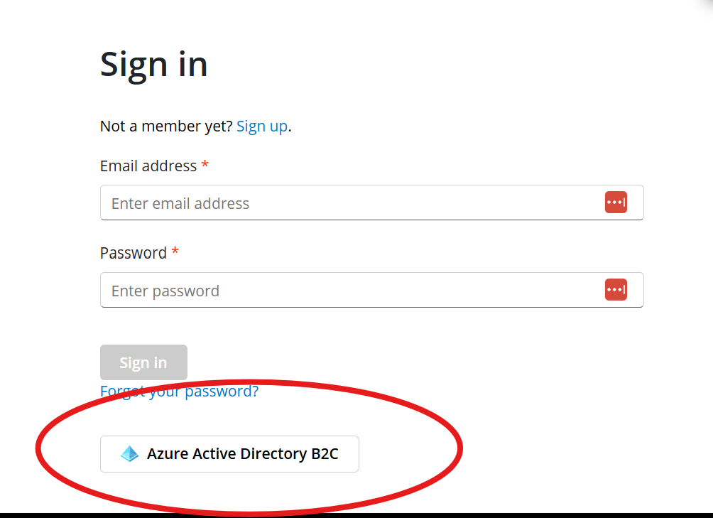
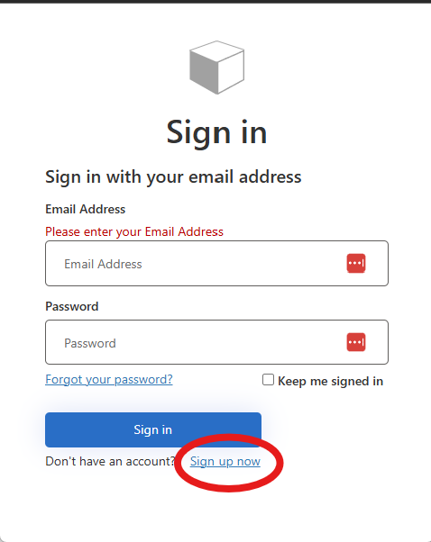
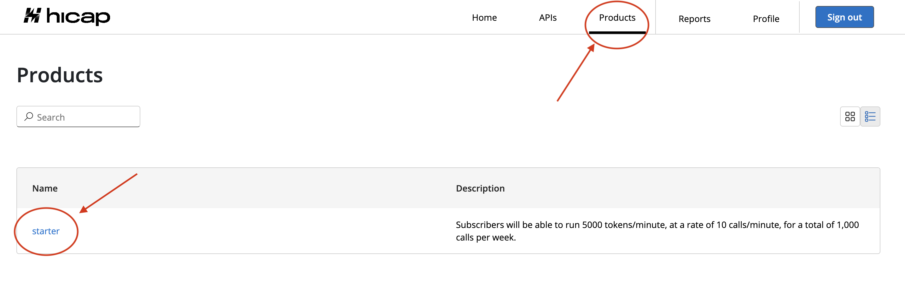
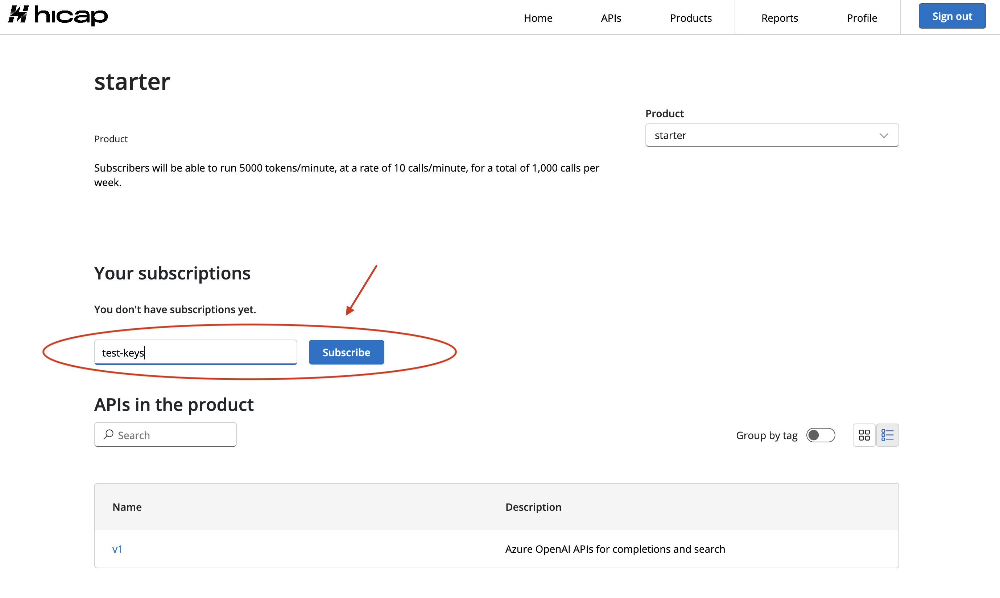
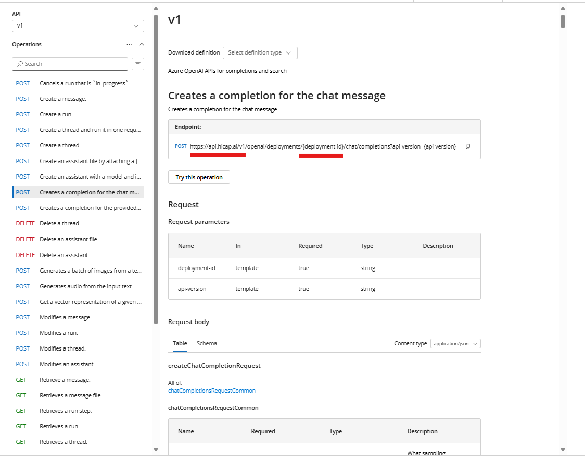

# Hicap Onboarding Guide

Follow this interactive guide to set up your account and start using the Hicap API.

## 1. Sign in to the Hicap portal

Navigate to:

```bash
https://portal.hicap.ai/signin
```

## 2. Authenticate with Azure AD B2C

Click the Azure **Active Directory B2C** button to create a new account or sign in with an existing one.



---

## 3. Create your Hicap account

If you're not registered, click **Sign up** now and complete the account creation form.



---

## 4. Subscribe to the “Starter” product

1. In the top navigation bar, select **Products**.



2. Click on **starter**.
3. Under "Your subscriptions", enter a name for your subscription (e.g., `test-keys`) and hit **Subscribe**.



---

## 5. Retrieve your Hicap API key

1. After subscribing, your new subscription will appear in the list.
2. Click on it to reveal your **API key**.
3. Copy this value and store it securely.

---

## 6. Configure your OpenAI SDK

1. Go to the **APIs** tab and select `v1` to access the Hicap v1 API reference.
2. Take note of the **Base URL** and the `api-key` header.




3. Choose a model

---

## Available Model/Version

| Provider  | Model ID                                              | API Version           |
| ---------- | ----------------------------------------------------- | --------------------- |
| **OpenAI** | `model-router`                                        | `2025-01-01-preview`  |
| **OpenAI** | `gpt-4o`                                              | `2025-01-01-preview`  |
| **OpenAI** | `gpt-4o-mini`                                         | `2025-01-01-preview`  |
| **OpenAI** | `gpt-4.1`                                             | `2025-01-01-preview`  |
| **OpenAI** | `gpt-4.1-mini`                                        | `2025-01-01-preview`  |
| **OpenAI** | `gpt-4.1-nano`                                        | `2025-01-01-preview`  |
| **Anthropic** | `us.anthropic.claude-3-5-sonnet-20241022-v2:0`      | Not Applicable        |
| **Anthropic** | `us.anthropic.claude-3-7-sonnet-20250219-v1:0`      | Not Applicable        |

---

## Sample codes

<CodeGroup>

  ```python python
import os
from openai import AzureOpenAI

client = AzureOpenAI(
    azure_endpoint = os.getenv("BASE_URL"), 
    azure_ad_token_provider=os.getenv("API_KEY"),
    api_version=os.getenv("API_VERSION")
)

model_name=os.getenv("MODEL")

# Send a completion call to generate an answer
print('Sending a test completion job')
start_phrase = 'Write a tagline for an ice cream shop. '
response = client.completions.create(model=model_name, prompt=start_phrase, max_tokens=10)
print(start_phrase+response.choices[0].text)
  ```

```javascript javascript
import * as dotenv from "dotenv";
import { AzureOpenAI } from "openai";

dotenv.config();

const client = new AzureOpenAI({
  azureEndpoint: process.env.BASE_URL,
  azureAdTokenProvider: process.env.API_KEY,
  apiVersion: process.env.API_VERSION,
});

const modelName = process.env.MODEL;

(async () => {
  console.log("Sending a test completion job");
  const startPhrase = "Write a tagline for an ice cream shop. ";
  const response = await client.completions.create({
    model: modelName,
    prompt: startPhrase,
    max_tokens: 10,
  });
  console.log(startPhrase + response.choices[0].text);
})();
```

```bash curl
# Make sure these are set in your environment:
# BASE_URL      e.g. https://api.hicap.ai/v1
# API_KEY       your Hicap/Azure OpenAI key
# API_VERSION   e.g. 2025-01-01-preview
# MODEL         e.g. gpt-4.1

curl -X POST "${BASE_URL}/openai/deployments/${MODEL}/completions?api-version=${API_VERSION}" \
  -H "Content-Type: application/json" \
  -H "api-key: ${API_KEY}" \
  -d '{
    "prompt": "Write a tagline for an ice cream shop. ",
    "max_tokens": 10
  }'
```

</CodeGroup>